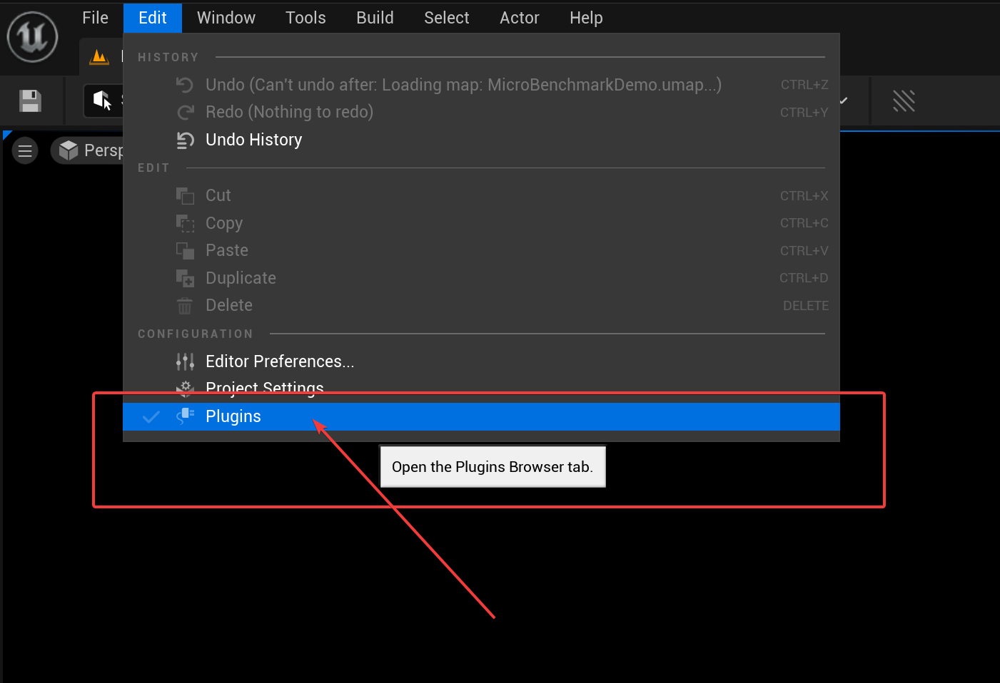
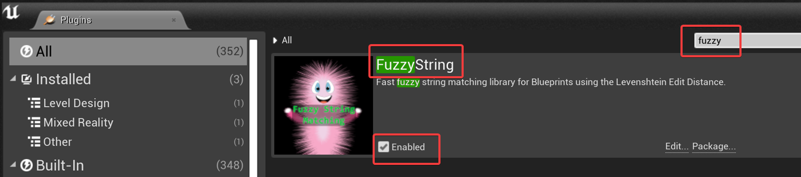
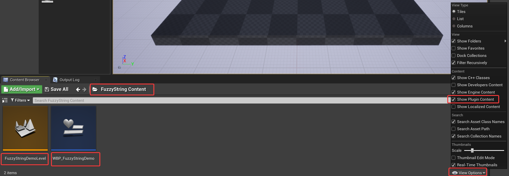
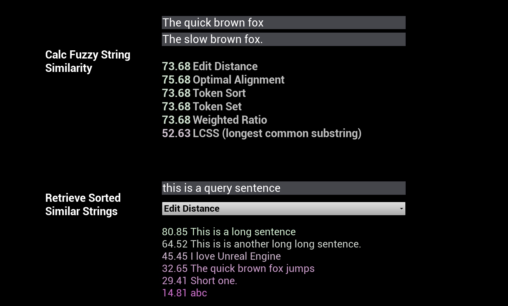
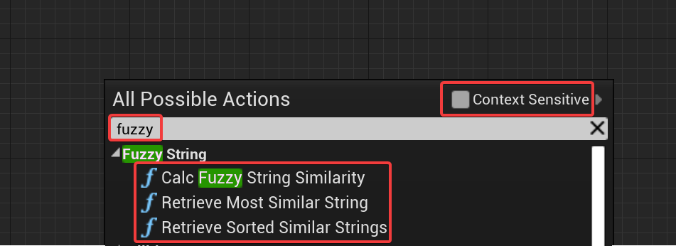
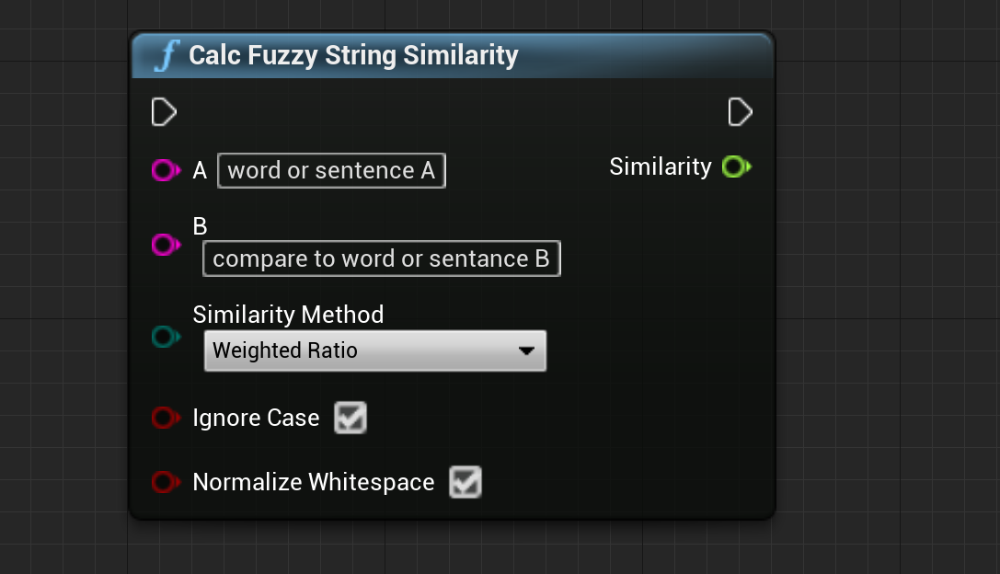
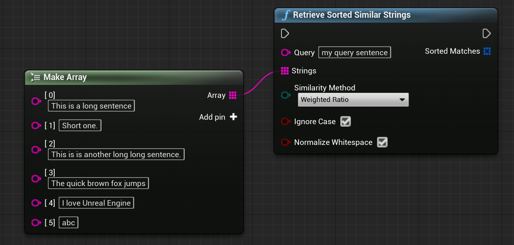
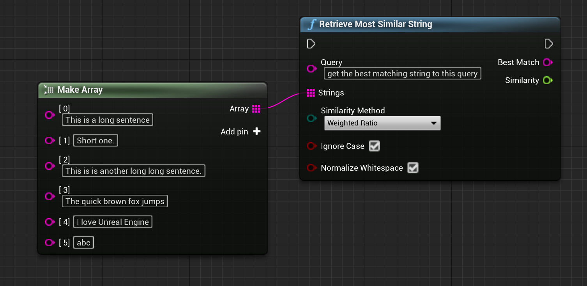

# Fuzzy String
## Calculate approximate string / text similarity in Unreal Blueprints or C++.

- [Documentation](https://maschere.github.io/asset-documentation/fuzzy-string)
- [C++ Doxygen Docs](https://maschere.github.io/asset-documentation/fuzzy-string/docs/index.html)
- [Support Forum](https://github.com/maschere/asset-documentation/discussions/categories/fuzzy-string)
- [Marketplace Link](https://www.unrealengine.com/marketplace/en-US/profile/maschere)

## Step-by-step usage guide
- Open the plugin settings of your project.
   
- Make sure *FuzzyString* is enabled. Restart UE eventually.  
- *Optional*: The plugin contains a demo to conviniently try out the different string similarity methods. To open it, make sure you have *Show Plugin Content* enabled.    Then look under *FuzzyString Content* to open the demo level to try out the widget or open the widget to see how the plugin is used.  
- Within any Blueprint Graph, right click and type *fuzzy* (eventually disable context) to see the three main fuzzy string matching nodes. They are described below.  
  - **Calc Fuzzy String Simimlarity**: Calculate the approximate (*fuzzy*) similarity between the strings A and B with the specified method.  
  - **Retrieve Sorted Similar Strings**: Calculate the approximate (*fuzzy*) similarity between the Query String and and all the strings in the array. Returns the sorted array of strings with their similaritiy values.  
  - **Retrieve Most Similar String**: Calculate the approximate (*fuzzy*) similarity between the Query String and and all the strings in the array. Returns only the **most** similar string and its similarity value.  
- That's a wrap. Cheers.

## FAQ
- Q: In what kind of Blueprints can use Fuzzy String? 
  A: Anywhere. Event Graphs, Functions, Macros, Widget / Level Blueprints.
- Q: Which string similarity method is the best? 
  A: It depends. I suggest trying them out for your use-case, though *Weighted Ratio* is a good starting point, as that is a weighted average of all other (except LCSS) methods.
- Q: How fast is it? 
  A: Extremely fast and neglible even if you call it on tick.
  

## C++ Usage
- Enable the FuzzyString Plugin in you C++ project by including *FuzzyString* in your *.Build.cs* under *PrivateDependencyModuleNames* and make sure it is included and enabled in your *.uproject* file.
- Include *FuzzyStringLibrary.h* in your .cpp
- Full [C++ API documentation here](./docs/index.html) and in the source code itself.