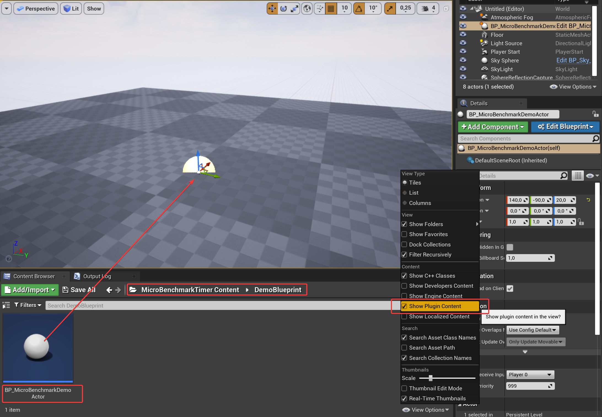

# MicroBenchmark
## Easy to use profiling tool to measure code performance in Unreal Blueprints or C++.

- [Documentation](https://github.com/maschere/asset-documentation/micro-benchmark)
- [C++ Doxygen Docs](https://github.com/maschere/asset-documentation/micro-benchmark/docs/index.html)
- [Support Forum](https://github.com/maschere/asset-documentation/discussions/categories/microbenchmark)
- [Marketplace Link](https://www.unrealengine.com/marketplace/en-US/product/440f7dbfc0014afaab135cd12f01d72b)

## Step-by-step usage guide
- Open the plugin settings of your project.
   
- Make sure *MicroBenchmarkTimer* is enabled. Restart UE eventually.  
- Within any Blueprint Graph, right click and type *benchmark* to get the *MicroBenchmarkSubsystem* node.  
- From the MicroBenchmarkSubsystem node, you'll see all available functions under the *Micro Benchmark* tab. We'll get into those in a minute.  
- *Optional*: The plugin contains a demo blueprint actor containing the two example blueprints shown next. To open it, make sure you have *Show Plugin Content* enabled. Then look under *Plugins/MicroBenchmarkTimer/DemoBlueprint* or search for *MicroBenchmarkDemoActor*. Drag the blueprint into any level and open the blueprint graph.  
- **Tic-Toc** Example. Let's say under *BeginPlay* (**1**) of your level blueprint, you want to measure how long it takes to retrieve all StaticMeshActors (**2**). Simply add a *Tic* node (**3**) before the *GetAllActorsOfClass* node to start measuring. Add a *Toc* node (**4**) right after the *GetAllActorsOfClass* node to clock the time it took. To immediately see the timing result on the screen and in your log, enable the *Show Log* flag (**5**).  
- **OnTick** Example. Now let's say under *EventTick* (**1**) you're doing a *line trace* (**2**) every frame. You could measure that as before, but that would result in too many log messages per second. Instead, give your Tic (**3**) a proper *benchmark name* (**4**) and disable the log flag in your Toc (**5**). Now have a look at the average timing across all line trace calls by calling the *Print Micro Benchmark Results* node (**6**). If you leave the benchmark name empty, all benchmark results will be printed. In this case, you're printing the results with a *B* keyboard press. Though you could print results with a timer every 5 seconds or so, or on any other event you choose.  
- That's a wrap. Cheers.

## FAQ
- Q: What happens if I call Tic again with the same benchmark name? 
  A: The old Tic start-time gets overwritten and the execution time is measured from the last recent Tic call.
- Q: What happens if I call Toc again with the same benchmark name? 
  A: Nothing.
- Q: Why is the runtime from Tic to Toc without any code inbeetween not 0? 
  A: That's the Blueprint overhead of calling those functions. On my machine it's around 1.5 microseconds.
- Q: Why are the benchmark functions called Tic and Toc? 
  A: The names are **not** inspired by a certain social network, but rather by two old-school [MATLAB](https://www.mathworks.com/help/matlab/ref/tic.html) functions of the same name.
  

## C++ Usage
- Enable the MicroBenchmark Plugin in you C++ project by including *MicroBenchmarkTimer* in your *.Build.cs* under *PrivateDependencyModuleNames* and make sure it is included and enabled in your *.uproject* file.
- Include *MicroBenchmarkSubsystem.h* in your .cpp
- Use the TIC and TOC macros (useable within any UObject) to measure the execution time of all the code inbetween.
- Full [C++ API documentation here](./docs/index.html) and in the source code itself.